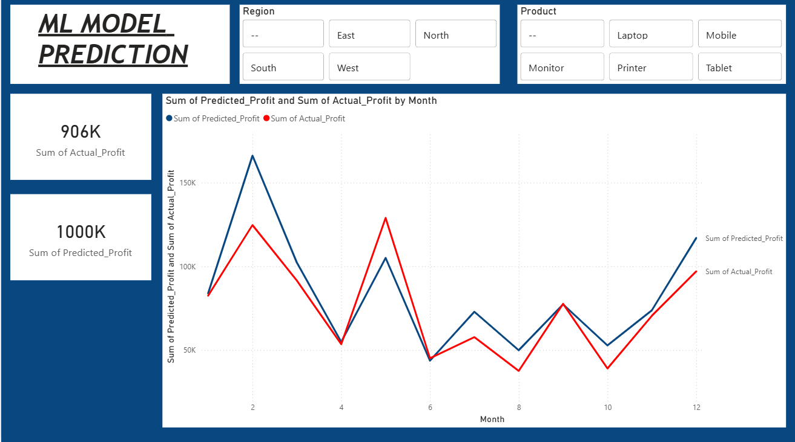

# Sales Analytics Pipeline

This is my data analytics project where I built a complete pipeline 
from raw sales data to an interactive Power BI dashboard with an ML model prediction page.

## Dashboard Preview

### Page 1 - Monthly Sales Growth

### Page 2 - ML Model Prediction

## What this project does

- Takes raw sales data from an Excel file
- Cleans the data using Python and pandas
- Stores the cleaned data in a MySQL database
- Trains a machine learning model to predict profit
- Visualizes the data and predictions using a Power BI dashboard

## Tools and Technologies used

- Python
- pandas
- Scikit-learn (Linear Regression for profit prediction)
- MySQL
- SQLAlchemy
- pymysql
- Power BI
- Jupyter Notebook

## Project Steps

**Step 1 - Data Cleaning (cleaning.ipynb)**
Loaded raw Excel data of 520 rows, removed 20 duplicate rows, 
fixed invalid dates, and created 3 new columns - Profit, Year and Month.
Final clean data has 482 rows and 10 columns.

**Step 2 - Load to MySQL (cleaning.ipynb)**
Connected Python to MySQL using SQLAlchemy and loaded the 
cleaned data into a database called salesdb.

**Step 3 - Append New Data (append_2026.ipynb)**
Loaded new 2026 sales data and appended it to the existing 
MySQL table. Total records went from 482 to 682.

**Step 4 - ML Model Prediction (profit_prediction.ipynb)**
Trained a Linear Regression model using Scikit-learn to predict monthly profit.
Exported actual vs predicted profit values to a CSV and loaded it into Power BI.
Model shows predicted profit of 1000K vs actual profit of 906K.

**Step 5 - Power BI Dashboard**
Connected Power BI directly to MySQL and built an interactive dashboard with 2 pages:
- Page 1: Monthly sales growth, region-wise profit and product-wise sales
- Page 2: ML model prediction showing actual vs predicted profit by month

## Files in this project

- cleaning.ipynb - data cleaning and MySQL loading notebook
- append_2026.ipynb - new data append notebook
- profit_prediction.ipynb - ML model training and prediction notebook
- sales_raw_500.xlsx - original raw data
- sales_raw_new_2026.csv - new 2026 data
- sales_cleaned.csv - cleaned output data

